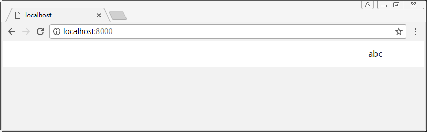

# session

- 新建自定义中间价目录 middlewares
- 新建工具目录 utils

## 注意
- 当前实现的session是存在内存中的，而且没有过期时效，就随机生成了id
- 与模板间的数据传递 ctx.state
- 模板引擎的条件判断

## 目录
```sh
├── config.js               # 配置文件
├── public                  # 静态资源目录
└── server                  # 后端代码目录
    ├── db                  # 数据库目录
    ├── middlewares         # 自定义中间件目录
    │   └── session.js      # session中间件
    ├── models              # 数据模型目录
    ├── routers             # 路由目录
    ├── services            # 逻辑服务目录
    ├── utils               # 工具目录
    │   └── session.js      # session生成工具
    ├── views               # 视图目录
    └── app.js              # 入口文件
```

## server/middlewares/session.js
``` js
/**
 * session中间件
 */

const { sessions, key } = require('../utils/session')

module.exports = () => {
    return async (ctx, next) => {
        let id = ctx.cookies.get(key)
        if (!id) {
            ctx.session = {}
        } else {
            const session = sessions[id]
            if (session) {
                ctx.session = session
            } else {
                ctx.session = {}
            }
        }
        await next()
    }
}
```

## server/utils/session.js
``` js
/**
 * session
 */

const key = 'SESSION-ID'

const sessions = {}

const generate = () => {
    const session = {}
    session.id = (new Date()).getTime() + Math.random()
    sessions[session.id] = session
    return session    
}

const setSession = (ctx, {id, name}) => {
    ctx.session = generate()
    ctx.session.userId = id
    ctx.session.userName = name
    ctx.cookies.set(key, ctx.session.id)
}

module.exports = {
    key,
    sessions,
    generate,
    setSession
}
```

## server/views/components/header.hbs
``` html
{{!-- 头部 --}}
<header>
  <nav>
    {{#if session.userName }}
      <p id="username-text">{{ session.userName }}</p>
      <a href="#" class="hide" id="account-btn">登录</a>
    {{else}}
      <p class="hide" id="username-text"></p>
      <a href="#" id="account-btn">登录</a>
    {{/if}}
  </nav>
</header>
```

## server/routers/home.js
``` js
/**
 * home 子路由
 */
const router = require('koa-router')()

module.exports = router.get('/', async ctx => {
    const session = ctx.session
    ctx.state = { session }
    await ctx.render('home')
})
```

## server/services/user.js
``` js
const db = require('../db/util')
const { setSession } = require('../utils/session')

const user = {

    /**
     * 处理注册逻辑
     * @param {context} ctx 
     */
    async signUp(ctx) {
        const info = ctx.request.body
        const name = info.userName
        const password = info.password
        let results = await db.find({name})
        ctx.body = '注册失败'
        if (results.length > 0) {
            ctx.body = '用户名已被注册'
        } else {
            results = await db.insert({name, password})
            if (results) {
                const id = results[0].id
                ctx.body = info
                setSession(ctx, {id, name})
            }
        }
    },

    /**
     * 处理登录逻辑
     * @param {context} ctx
     */
    async signIn(ctx) {
        const info = ctx.request.body
        const name = info.userName
        const password = info.password
        let results = await db.find({name, password})
        ctx.body = '登录失败'
        if (results.length > 0) {
            const id = results[0].id
            ctx.body = info
            setSession(ctx, {id, name})
        } else {
            ctx.body = '用户或密码错误'
        }
    }
    
}

module.exports = user
```

## 执行

### 脚本
```sh
node server/app.js
```

### 结果


