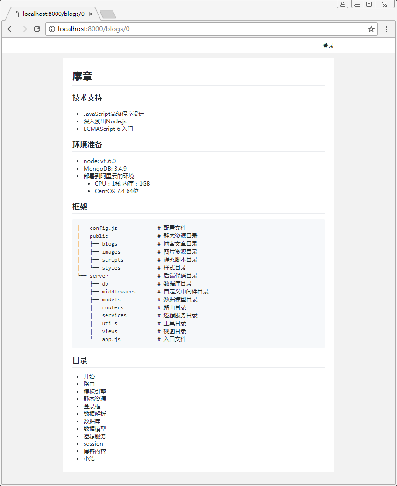

# 博客内容

- 增加博客路由
- 增加博客处理服务
- 增加博客模板
- 添加md转html的工具
```sh
yarn add marked
```

## 注意
- 因为主页还没想好，所以home路由重定向到博客的序章 ctx.redirect('/blogs/0')
- makedown.css 的代码就不贴了，参考GitHub的

## 目录
```sh
├── config.js               # 配置文件
├── public                  # 静态资源目录
└── server                  # 后端代码目录
    ├── db                  # 数据库目录
    ├── middlewares         # 自定义中间件目录
    ├── models              # 数据模型目录
    ├── routers             # 路由目录
    │   ├── api.js          # api路由
    │   ├── blogs.js        # 博客路由
    │   ├── home.js         # home子路由
    │   └── index.js        # 总路由
    ├── services            # 逻辑服务目录
    │   ├── blog.js         # 博客逻辑处理服务
    │   └── user.js         # 用户逻辑处理服务
    ├── utils               # 工具目录
    ├── views               # 视图目录
    └── app.js              # 入口文件
```

## server/routers/blogs.js
``` js
/**
 * 博客路由
 */
const router = require('koa-router')()
const blog = require('../services/blog')

module.exports = router.get('/:id', blog.render)
```

## server/services/blog.js
``` js
const path = require('path')
const { readFile } = require('../utils/util')
const marked = require('marked')

const blog = {

    /**
     * 渲染博客
     * @param {context} ctx 
     */
    async render(ctx) {
        const session = ctx.session || {}
        const id = ctx.params.id
        const data = await readFile(path.join(__dirname, '../../public/blogs/' + id + '.md'))
        const content = marked(data.toString())
        ctx.state = { content, session }
        await ctx.render('blog')
    },

}

module.exports = blog
```

## server/views/blog.hbs
``` html
<!DOCTYPE html>
<html>
  <link rel="stylesheet" href="../styles/main.css">
  <link rel="stylesheet" href="../styles/makedown.css">
<body>
  {{!-- 导航头部 --}}
  {{> header }}

  {{!-- 主体 --}}
  <div class="blog">
    <div class="makedown">
      {{{ content }}}
    </div>
  </div>

  {{!-- 登录框 --}}
  {{> account }}

  {{!-- 脚本 --}}
  <script src="../scripts/main.js"></script>
</body>
</html>
```

## 执行

### 脚本
```sh
node server/app.js
```

### 结果
