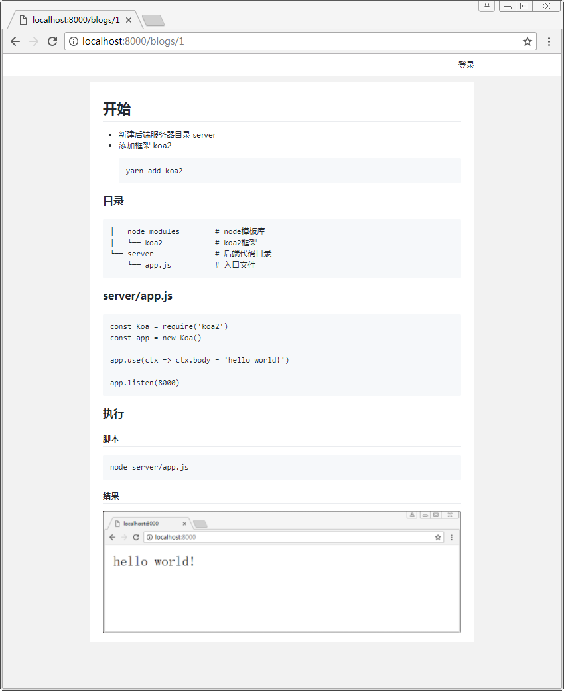

# 评论系统

- 增加博客数据模型

## 注意
- 之前埋的坑，db/util.js 中要多传递一个模型字段
- user的模型并没有id, id是mongoose模块用_id转的字符串
- 所以查找用户  db.find({ _id }) 还是要用 _id字段
- 还是老样子 comment.css 就不贴了，之后代码也只会贴一些核心，改动大的

## server/models/blog.js
``` js
const mongoose = require('mongoose')

const blogSchema = new mongoose.Schema({
    id: Number,
    comments: [{
        userId: String,
        content: String
    }]
})

module.exports = mongoose.model('blog', blogSchema)
```

## server/services/blog.js
``` js
const path = require('path')
const { readFile } = require('../utils/util')
const marked = require('marked')
const db = require('../db/util')

const blog = {

    /**
     * 渲染博客
     * @param {context} ctx 
     */
    async render(ctx) {
        const session = ctx.session || {}
        const id = ctx.params.id
        const data = await readFile(path.join(__dirname, '../../public/blogs/' + id + '.md'))
        const content = marked(data.toString())
        let comments = []
        let results = await db.find({ id }, 'Blog')
        if (results && results.length > 0){
            comments = results[0].comments
            comments.forEach(async (element, index) => {
                let userResults = await db.find({ _id: element.userId })
                if (userResults && userResults.length > 0) {
                    comments[index].userName = userResults[0].name
                } else {
                    comments[index].userName = ''
                }
            })
        } else {
            await db.insert({id, comments}, 'Blog')
        }

        ctx.state = { content, session, comments }
        await ctx.render('blog')
    },

    /**
     * 评论博客
     */
    async comment(ctx) {
        const session = ctx.session || {}
        const info = ctx.request.body
        const blogId = parseInt(info.blogId)
        const userId = session.userId
        const userName = session.userName
        const content = info.content
        if (userId) {
            const results = await db.update({id: blogId}, { $push: {comments: { userId, content }}}, 'Blog')
            ctx.body = { userName, content }
        } else {
            ctx.body = { error: 0 }  //没有登录的错误码
        }
    }

}

module.exports = blog
```

## server/views/components/comment.hbs
``` html
{{!-- 评论系统 --}}
<div class="comment">
  <div class="self-comment">
    <p id="comment-name"></p>
    <input type="text" id="comment-content" placeholder="写下你的评论 ……">
    <button id="comment-btn">评论</button>
  </div>
  <ul id="conments">
    {{#each comments}}
      <li>
        <h3>{{ this.userName }}</h3>
        <p class="comment-name">{{ this.content }}</p>
      </li>
    {{/each}}
  </ul>
</div>
```

## 执行

### 脚本
```sh
node server/app.js
```

### 结果

