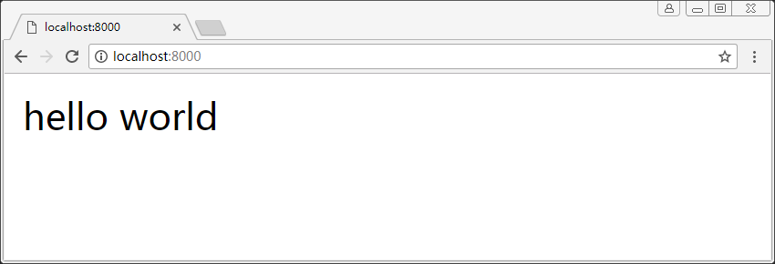

# 模板引擎

- 新建视图目录 views
- 添加视图中间件 koa-views
- 添加模版引擎 handlebars
```sh
yarn add koa-views
yarn add handlebars
```

## 目录
```sh
├── config.js             # 配置文件
└── server                # 后端代码目录
    ├── routers           # 路由目录
    ├── views             # 视图目录
    │   ├── home.hbs      # home视图
    │   └── index.js      # 视图参数
    └── app.js            # 入口文件
```

## server/views/index.js
``` js
/**
 * 视图参数
 */
const viewsEx = {
    map: {hbs: 'handlebars'},
    extension: 'hbs'
}

module.exports = viewsEx
```

## server/app.js
``` js
const path = require('path')
const Koa = require('koa2')
const views = require('koa-views')
const { port } = require('../config')
const viewsEx = require('./views/index')
const router = require('./routers/index')

// 创建koa实例
const app = new Koa()

// 配置模板引擎中间件
app.use(views(path.join(__dirname, './views'), viewsEx))

// 配置路由中间件
app.use(router.routes()).use(router.allowedMethods())

app.listen(port)

console.log(`the server start at port ${port}`)
```

## server/routers/home.js
``` js
/**
 * home 子路由
 */
const router = require('koa-router')()

module.exports = router.get('/', async ctx => await ctx.render('home'))
```

## server/views/home.hbs
``` html
<!DOCTYPE html>
<html>
<body>
  hello world
</body>
</html>
```

## 执行

### 脚本
```sh
node server/app.js
```

### 结果
