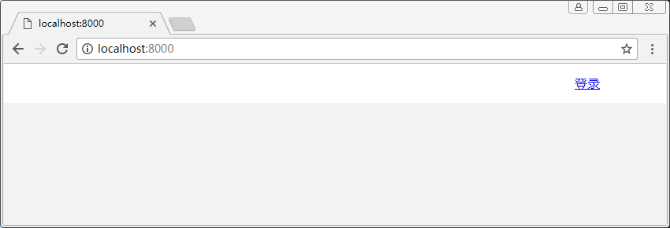

# 静态资源

- 制作导航头
- 在views下新建视图组件目录 components
- 新建静态资源目录 public
- 新建样式目录 styles
- 添加静态资源加载中间件 koa-static
```sh
yarn add koa-static
```

## 注意
- 模板组件的运用 options 配置 partials
- 静态资源的路径问题
- css 写的不好！！！

## 目录
```sh
├── config.js              # 配置文件
├── public                 # 静态资源目录
│   └── styles             # 样式目录
│       └── main.css       # 主体样式
└── server                 # 后端代码目录
    ├── routers            # 路由目录
    ├── views              # 视图目录
    │   └── components     # 视图组件目录
    │       └── header.hbs # 导航头
    └── app.js             # 入口文件
```

## server/views/index.js
``` js
/**
 * 视图参数
 */
const viewsEx = {
    map: {hbs: 'handlebars'},
    extension: 'hbs',
    options: {
        partials: {
            header: 'components/header',
        }
    }
}

module.exports = viewsEx
```

## server/app.js
``` js
const path = require('path')
const Koa = require('koa2')
const static = require('koa-static')
const views = require('koa-views')
const { port } = require('../config')
const viewsEx = require('./views/index')
const router = require('./routers/index')

// 创建koa实例
const app = new Koa()

// 配置静态资源加载中间件
app.use(static(path.join(__dirname, '../public')))

// 配置模板引擎中间件
app.use(views(path.join(__dirname, './views'), viewsEx))

// 配置路由中间件
app.use(router.routes()).use(router.allowedMethods())

app.listen(port)

console.log(`the server start at port ${port}`)
```

## server/views/home.hbs
``` html
<!DOCTYPE html>
<html>
<head>
  <link rel="stylesheet" href="../styles/main.css"> 
</head>
<body>
  {{!-- 导航头部 --}}
  {{> header }}
</body>
</html>
```

## server/views/components/header.hbs
``` html
{{!-- 头部 --}}
<header>
  <nav>
    <a href="#" id="account-btn">登录</a>
  </nav>
</header>
```

## public/styles/main.css
``` css
* { margin: 0; padding: 0; box-sizing: border-box; }

/* 主体 */
body {
  background-color: #f2f2f2;
  color: #24292e;
}

/* 头部 */
header {
  height: 50px;
  background-color: #fff;
}
header nav {
  width: 80%;
  height: 100%;  
  margin: 0 auto;
}
header nav a {
  float: right;
  line-height: 50px;
}
```

## 执行

### 脚本
```sh
node server/app.js
```

### 结果
