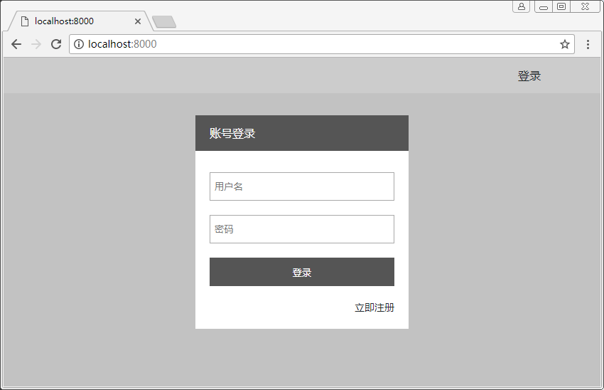
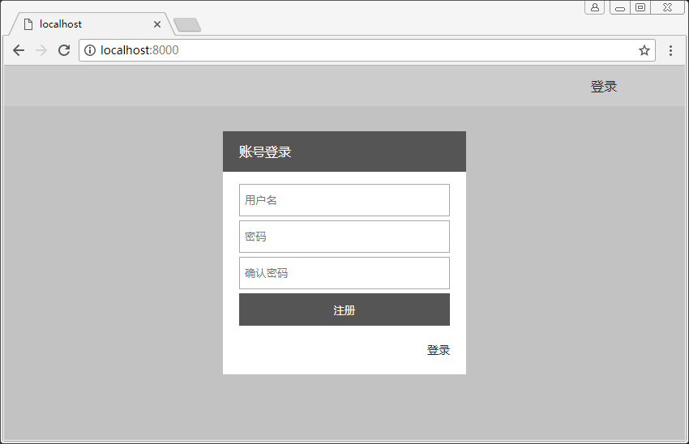

# 登录框

- 新建静态脚本目录 scripts
- 新建视图组件登录框 account.hbs

## 注意
- 原来除了css写不好， 静态脚本也写的很难看。。。

## 目录
```sh
├── config.js               # 配置文件
├── public                  # 静态资源目录
│   ├── scripts             # 静态脚本目录
│   │   └── main.js         # 主体脚本
│   └── styles              # 样式目录
└── server                  # 后端代码目录
    ├── routers             # 路由目录
    ├── views               # 视图目录
    │   └── components      # 视图组件目录
    │       ├── account.hbs # 登录框
    │       └── header.hbs  # 导航头
    └── app.js              # 入口文件
```

## server/views/index.js
``` js
/**
 * 视图参数
 */
const viewsEx = {
    map: {hbs: 'handlebars'},
    extension: 'hbs',
    options: {
        partials: {
            header: 'components/header',
            account: 'components/account',
        }
    }
}

module.exports = viewsEx
```

## server/views/home.hbs
``` html
<!DOCTYPE html>
<html>
<head>
  <link rel="stylesheet" href="../styles/main.css"> 
</head>
<body>
  {{!-- 导航头部 --}}
  {{> header }}

  {{!-- 登录框 --}}
  {{> account }} 
  
  <script src="../scripts/main.js"></script>
</body>
</html>
```

## server/views/components/account.hbs
``` html
{{!-- 账号弹框 --}}
<div class="mask hide" id="mask"></div>
<div class="account-pop hide" id="account-pop">
  <p>账号登录</p>
  <div id="sign-in-content">
    <input type="text" id="sign-in-username" placeholder="用户名">
    <input type="password" id="sign-in-password" placeholder="密码">
    <button id="sign-in">登录</button>
  </div>
  <div id="sign-up-content" class="hide">
    <input type="text" id="sign-up-username" placeholder="用户名">
    <input type="password" id="sign-up-password" placeholder="密码">
    <input type="password" id="sign-up-confirm" placeholder="确认密码">
    <button id="sign-up">注册</button>
  </div>
  <a href="#" id="show-sign-up">立即注册</a>
  <a href="#" class="hide" id="show-sign-in">登录</a>
</div>
```

## public/scripts/main.js
``` js
window.onload = () => {
    const accountBtn = document.getElementById('account-btn')
    const mask = document.getElementById('mask')
    const accountPop = document.getElementById('account-pop')
    const showSignUp = document.getElementById('show-sign-up')
    const showSignIn = document.getElementById('show-sign-in')
    const signInContent = document.getElementById('sign-in-content')
    const signUpContent = document.getElementById('sign-up-content')
    const signIn = document.getElementById('sign-in')
    const signInUserName = document.getElementById('sign-in-username')
    const signInPassword = document.getElementById('sign-in-password')
    const signUp = document.getElementById('sign-up')
    const signUpUserName = document.getElementById('sign-up-username')
    const signUpPassword = document.getElementById('sign-up-password')
    const signUpConfirmPassword = document.getElementById('sign-up-confirm')

    /**
     * 弹出登录框
     */
    accountBtn.addEventListener('click', e => {
        e.preventDefault()
        accountPop.style.display = 'block'
        mask.style.display = 'block'
        mask.style.width = window.screen.width + 'px'
        mask.style.height = window.screen.height + 'px'
    })

    /**
     * 关闭
     */
    const close = () => {
        accountPop.style.display = 'none'
        mask.style.display = 'none'
        signInContent.style.display = 'block'
        signUpContent.style.display = 'none'
        showSignUp.style.display = 'block'
        showSignIn.style.display = 'none'
    }

    /**
     * 点击遮罩处关闭
     */
    mask.addEventListener('click', close)

    /**
     * 显示注册
     */
    showSignUp.addEventListener('click', e => {
        e.preventDefault()
        signInContent.style.display = 'none'
        signUpContent.style.display = 'block'
        showSignUp.style.display = 'none'
        showSignIn.style.display = 'block'
    })

    /**
     * 显示登录
     */
    showSignIn.addEventListener('click', e => {
        e.preventDefault()
        signInContent.style.display = 'block'
        signUpContent.style.display = 'none'
        showSignUp.style.display = 'block'
        showSignIn.style.display = 'none'
    })

}
```

## public/styles/main.css
``` css
* { margin: 0; padding: 0; box-sizing: border-box; }

/* 公用 */
a,
a:link,
a:visited,
a:active { color: #24292e; }
a { text-decoration: none; }
ul { list-style: none; }
.hide { display: none; }

/* 主体 */
body {
  background-color: #f2f2f2;
  color: #24292e;
}

/* 头部 */
header {
  height: 50px;
  background-color: #fff;
}
header nav {
  width: 80%;
  height: 100%;  
  margin: 0 auto;
}
header nav a {
  float: right;
  line-height: 50px;
}

/* 遮罩 */
.mask {
  position: fixed;
  top: 0;
  left: 0;
  display: none;
  background: rgba(0, 0, 0, .2);
}

/* 登录弹出框 */
.account-pop {
  position: fixed;
  top: 50%;
  left: 50%;
  width: 300px;
  height: 300px;
  margin-left: -150px;
  margin-top: -150px;
  display: none;
  background-color: #fff;
}
.account-pop p {
  height: 50px;
  padding-left: 20px;
  margin-bottom: 10px;
  line-height: 50px;
  color: #fff;
  background-color: #555;
}
.account-pop input {
  width: 260px;
  height: 40px;
  margin: 20px 20px 0 20px;
  padding: 5px;
}
.account-pop button {
  width: 260px;
  height: 40px;
  margin: 20px 20px 0 20px;
  color: #fff;
  border: 0;
  background: #555;
  cursor: pointer;
}
.account-pop a {
  float: right;
  margin: 20px 20px 0 0;
  font-size: 14px;
}
.account-pop a:hover { text-decoration: underline; }
.account-pop .hide input { margin: 5px 20px 0 20px; }
.account-pop .hide button { margin: 5px 20px 0 20px; }
```

## 执行

### 脚本
```sh
node server/app.js
```

### 结果
#### 登录

#### 注册
