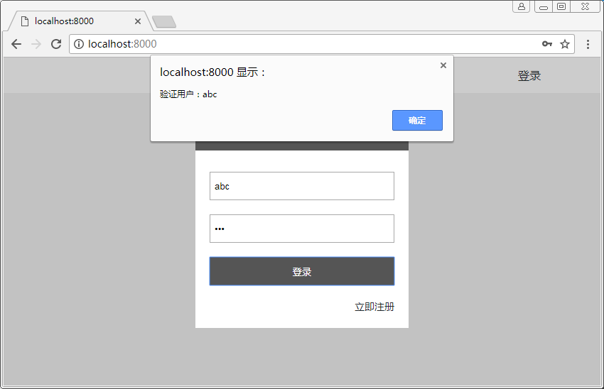

# 数据解析

- 简单实现注册登录
- 添加api路由
- 添加数据解析中间件 koa-bodyparser
```sh
yarn add koa-bodyparser
```

## 注意
- 前端发来的数据解析后的位置 ctx.request.body

## 目录
```sh
├── config.js               # 配置文件
├── public                  # 静态资源目录
└── server                  # 后端代码目录
    ├── routers             # 路由目录
    │   ├── api.js          # restful api 子路由
    │   ├── home.js         # home子路由
    │   └── index.js        # 总路由
    ├── views               # 视图目录
    └── app.js              # 入口文件
```

## server/app.js
``` js
const path = require('path')
const Koa = require('koa2')
const bodyparser = require('koa-bodyparser')
const static = require('koa-static')
const views = require('koa-views')
const { port } = require('../config')
const viewsEx = require('./views/index')
const router = require('./routers/index')

// 创建koa实例
const app = new Koa()

// 配置数据解析中间件
app.use(bodyparser())

// 配置静态资源加载中间件
app.use(static(path.join(__dirname, '../public')))

// 配置模板引擎中间件
app.use(views(path.join(__dirname, './views'), viewsEx))

// 配置路由中间件
app.use(router.routes()).use(router.allowedMethods())

app.listen(port)

console.log(`the server start at port ${port}`)
```

## server/routers/index.js
``` js
/**
 * 总路由
 */
const router = require('koa-router')()

const home = require('./home')
const api = require('./api')

router.use('/', home.routes(), home.allowedMethods())
router.use('/api', api.routes(), api.allowedMethods())

module.exports = router
```

## server/routers/api.js
``` js
/**
 * restful api 子路由
 */
const router = require('koa-router')()

module.exports = router.post('/signUp', ctx => ctx.body = `验证用户：${ctx.request.body.userName}`)
                       .post('/signIn', ctx => ctx.body = `验证用户：${ctx.request.body.userName}`)
```

## public/scripts/main.js  添加登录和注册按钮的点击事件
``` js
/**
 * 登录
 */
signIn.addEventListener('click', e => {
    e.preventDefault()
    const userName = signInUserName.value
    const password = signInPassword.value
    if (userName == '' || password == '') {
        alert('用户名密码不能为空！')
        return
    }
    const xhr = new XMLHttpRequest()
    xhr.onreadystatechange = () => {
        if (xhr.readyState == 4 && xhr.status == 200) {
            alert(xhr.responseText)
        }
    }
    xhr.open('post', '/api/signIn', true)
    xhr.setRequestHeader("Content-type","application/x-www-form-urlencoded")
    xhr.send(`userName=${userName}&password=${password}`)
})

/**
 * 注册
 */
signUp.addEventListener('click', e => {
    e.preventDefault()
    const userName = signUpUserName.value
    const password = signUpPassword.value
    const confirmPassword = signUpConfirmPassword.value
    if (userName == '' || password == '' || confirmPassword == '') {
        alert('用户名密码不能为空！')
        return
    }
    if (password != confirmPassword) {
        alert('确认密码错误！')
        return
    }
    const xhr = new XMLHttpRequest()
    xhr.onreadystatechange = () => {
        if (xhr.readyState == 4 && xhr.status == 200) {
            alert(xhr.responseText)
        }
    }
    xhr.open('post', '/api/signUp', true)
    xhr.setRequestHeader("Content-type","application/x-www-form-urlencoded")
    xhr.send(`userName=${userName}&password=${password}`)
})

```


## 执行

### 脚本
```sh
node server/app.js
```

### 结果

