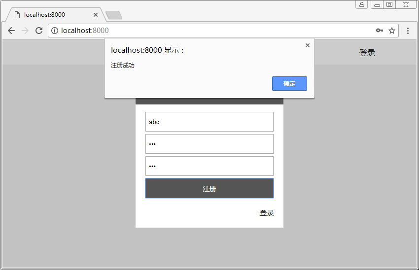
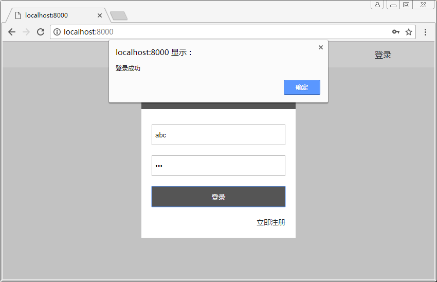

# 逻辑服务

- 新建逻辑服务目录 services

## 注意
- 这里操作数据库的工具写死了用 User 模型

## 目录
```sh
├── config.js               # 配置文件
├── public                  # 静态资源目录
└── server                  # 后端代码目录
    ├── db                  # 数据库目录
    │   ├── db.js           # db
    │   └── util.js         # 数据库处理工具
    ├── models              # 数据模型目录
    ├── routers             # 路由目录
    ├── services            # 逻辑服务目录
    │   └── user.js         # 用户逻辑处理服务
    ├── views               # 视图目录
    └── app.js              # 入口文件
```

## server/db/util.js
``` js
const User = require('../models/user')

/**
 * 插入数据
 * @param {Object} options
 */
const insert = function(obj) {
    return new Promise((resolve, reject) => {
        const user = new User(obj)
        user.save((err, res) => {
            if (err)
                reject(err)
            else
                resolve(res)
        })
    })
}

/**
 * 查询数据
 * @param {Object} options
 */
const find = function(options) {
    return new Promise((resolve, reject) => {
        User.find(options ,(err, res) => {
            if (err)
                reject(err)
            else
                resolve(res)
        })
    })
}

module.exports = {
    insert,
    find
}
``` 

## server/services/user.js
``` js
const db = require('../db/util')

const user = {

    /**
     * 处理注册逻辑
     * @param {context} ctx 
     */
    async signUp(ctx) {
        const info = ctx.request.body
        const name = info.userName
        const password = info.password
        let results = await db.find({name})
        ctx.body = '注册失败'
        if (results.length > 0) {
            ctx.body = '用户名已被注册'
        } else {
            results = await db.insert({name, password})
            if (results) {
                ctx.body = '注册成功'
            }
        }
    },

    /**
     * 处理登录逻辑
     * @param {context} ctx
     */
    async signIn(ctx) {
        const info = ctx.request.body
        const name = info.userName
        const password = info.password
        let results = await db.find({name, password})
        ctx.body = '登录失败'
        if (results.length > 0) {
            ctx.body = '登录成功'
        } else {
            ctx.body = '用户或密码错误'
        }
    }
    
}

module.exports = user
```

## server/routers/api.js
``` js
const router = require('koa-router')()
const user = require('../services/user')

module.exports = router.post('/signUp', user.signUp)
                       .post('/signIn', user.signIn)
```

## 执行

### 脚本
```sh
node server/app.js
```

### 结果
#### 注册成功


#### 登录成功
